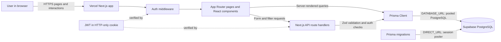

# Issue Tracker System

## Overview

Issue Tracker System is a full-stack application for creating, assigning, tracking, and commenting on team issues.

## Features

- User registration and login
- Secure JWT authentication with HTTP-only cookies
- Issue creation, editing, and deletion
- Assignment to registered users
- Status tracking and priority management
- Dashboard statistics and recent issues
- Case-insensitive search and database-backed filters
- Issue comments with author-only deletion
- Responsive interface for desktop, tablet, and mobile

## Architecture

The application uses the Next.js App Router. Server-rendered pages protect authenticated routes and load dashboard/issue details through Prisma. Client components call authenticated Next.js route handlers for login, registration, issue CRUD, user lists, filtering, and comments. Prisma connects to Supabase PostgreSQL; Zod validates request data before database writes. JWT sessions are stored in HTTP-only cookies.



## Technology Stack

- Next.js
- JavaScript (ES modules and JSX)
- Tailwind CSS
- PostgreSQL (Supabase)
- Prisma
- JWT (`jose`)
- `bcryptjs`
- Zod

## Project Structure

- `app/`: Next.js pages, loading/error boundaries, and API routes
- `components/`: Layout, dashboard, issue, comment, and UI components
- `lib/`: Prisma client, authentication helpers, and validation schemas
- `prisma/`: Database schema, migrations, and development seed script
- `types/`: Shared runtime Prisma enum exports
- `middleware.js`: Redirects unauthenticated users away from protected pages

## Prerequisites

- Node.js 20 LTS (Node.js 18.18 or newer)
- PostgreSQL
- npm

## Installation

```sh
git clone <repository-url>
cd <project-folder>
npm install
```

## Environment Setup

Copy `.env.example` to `.env` and replace the password placeholders with the Supabase **database password**. Do not commit `.env` or paste its contents into issue trackers or chat.

```dotenv
DATABASE_URL="postgresql://postgres.<project-ref>:<password>@<region>.pooler.supabase.com:6543/postgres?pgbouncer=true"
DIRECT_URL="postgresql://postgres.<project-ref>:<password>@<region>.pooler.supabase.com:5432/postgres"
JWT_SECRET="replace-with-a-long-random-secret"
```

Copy the complete pooler connection strings from Supabase **Connect**. `DATABASE_URL` uses the transaction pooler for application runtime; `DIRECT_URL` uses the session pooler for migrations. URL-encode special characters in the database password. Use a strong, unique `JWT_SECRET` outside development. The checked-in `.env.example` contains placeholders only.

## Database Setup

```sh
npx prisma migrate dev
npx prisma generate
npx prisma db seed
```

The seed command is configured in `package.json` as `node prisma/seed.js`. It ensures the sample users, issues, and comments exist without deleting unrelated records. Seed data is for development/testing only.

## Development Server

```sh
npm run dev
```

Open <http://localhost:3000>.

## Deployment

The application is designed for **Vercel** with **Supabase PostgreSQL**. The deployment approach is to connect the GitHub repository to Vercel (or deploy with the Vercel CLI), configure production environment variables in the Vercel project settings, and deploy the Next.js production build. Required services are a Vercel project, a Supabase PostgreSQL project, and the GitHub repository (for Git-based deployments).

Required Vercel environment variables:

- `DATABASE_URL`: Supabase transaction pooler URL on port `6543` with `pgbouncer=true`.
- `DIRECT_URL`: Supabase session pooler URL on port `5432`, used by Prisma migrations.
- `JWT_SECRET`: a strong, randomly generated production secret.

Deployment/update steps:

1. Push the complete application source to the connected GitHub repository.
2. Import the repository into Vercel and use the detected Next.js settings (`npm install`, `npm run build`, output managed by Next.js).
3. Add the three environment variables to Vercel for Production and Preview as appropriate. Never commit or expose their values.
4. Apply committed database migrations with `npx prisma migrate deploy` from a trusted environment using the production `DIRECT_URL` before routing traffic to a schema-changing release.
5. Deploy to Production from Vercel. Subsequent pushes to the production branch trigger deployments; preview branches receive Preview deployments.
6. Verify `/login`, authentication, and the dashboard against the production Supabase database. Do not run the development seed against a production database unless sample accounts/data are explicitly desired.

Live deployment URL: <https://issue-tracker-system-tu7k.vercel.app/>

## Production Build

```sh
npm run build
npm start
```

## Main Routes

- `/login`
- `/register`
- `/dashboard`
- `/issues`
- `/issues/new`
- `/issues/[id]`
- `/issues/[id]/edit`

## API Endpoints

All issue, user, and comment endpoints require authentication. Registration and login are public; logout clears the authentication cookie.

### Authentication

- `POST /api/auth/register`
- `POST /api/auth/login`
- `POST /api/auth/logout`
- `GET /api/auth/me`

### Users

- `GET /api/users`

### Issues

- `GET /api/issues` (supports `search`, `status`, `priority`, and `assignedToId` query parameters)
- `POST /api/issues`
- `GET /api/issues/[id]`
- `PUT /api/issues/[id]`
- `DELETE /api/issues/[id]`

### Comments

- `GET /api/issues/[id]/comments`
- `POST /api/issues/[id]/comments`
- `DELETE /api/comments/[commentId]` (the comment owner only)

## Development/Test Credentials

Open the [Issue Tracker login page](https://issue-tracker-system-tu7k.vercel.app/login). These accounts are created by `npx prisma db seed`; seed the database before signing in. The credentials below are shared development/test defaults and must not be used for real users or in production.

| User | Email | Password |
| --- | --- | --- |
| Admin User | `admin@issuetracker.com` | `Admin@1234` |
| Developer User | `dev@issuetracker.com` | `Dev@1234` |
| Tester User | `tester@issuetracker.com` | `Tester@1234` |

## Git Preparation

`.gitignore` excludes `.env`, `.env.local`, `node_modules/`, and `.next/`. Before submitting, verify the repository status and ensure no local credentials are staged.

```sh
git status
git add .
git commit -m "Build issue tracker system"
git push
```